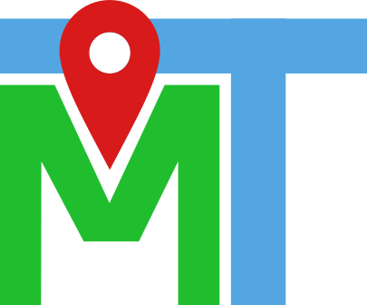

#        MapTogether 
### Search for spots a convenient distance from both you and your friends.

## What is MapTogether?
Want to have lunch with your friend but don't know where to go? Want to search for places that will mean less travel time for both of you? MapTogether allows you to search for spots you'll both have time to reach while minimizing fuel emissions! Search for scenic parks and cozy coffeeshops for well deserved mental health breaks! Enjoy exploring nature and adventuring down trails while catching up with the people who matter most!

## Problem Statement
We wanted a better way to search for locations between two people. With traditional maps applications you need to decide on where you want to meet before you can search and figure out where to go. This leads to longer walks/drives for both parties because you don't have a good sense of what's in the middle. Our goal was to solve this problem - helping users to find convenient and eco-friendly meet-up spots almost directly between their respective locations.

## Technology
We settled on Streamlit for our frontend and wrote Python code for the backend. We interfaced with the Google Maps API to search for route locations and further refined the results through our algorithm. We prioritized having comparatively equal commutes as well as a short total travel time.

## Challenges
We ran into initial issues deciding on a development environment and tech stack. We explored a couple of different approaches to creating our application (React, React Native, Flutter) and how feasible each would be to set up on our computers -and we settled on Streamlit. By focusing on creating a website with a good mobile UI, we could give users the option of using our project on phone or computer with minimal overhead (no need to download an app).

## Future Development
This application has a lot of potential for expansion and scaling. Right now our calculations only work for "Walking" or "Driving", but it would be very beneficial to add "Bicycling" and "Public Transit" options which line up with our sustainability ideals as those are lower emission forms of transportation and riding a bike is healthy exercise. We would also want to expand our app to work for more than just two locations, so you could get recommendations for a whole group of people to meet at. We can also definitely work on making the UI more impressive by displaying and filtering by more information about the selected locations like cost, whether they're open, whether you need a ticket, etc.